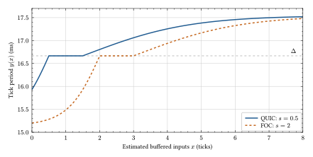

# DeFORM

**De**terministic **F**ully **O**nchain **R**ealtime **M**ultiplayer

DeFORM is a Rust library for deterministic multiplayer games. You provide the
game state, player inputs, and the function that advances one simulation tick.
DeFORM handles local prediction, authoritative updates, rollback, and client
timing. The same game logic can run offline, on a QUIC server, or onchain through
the Solana Virtual Machine and MagicBlock ephemeral rollups.

[Try an example](#try-an-example) · [Use the library](#use-the-library) ·
[Backends](#choose-a-backend) · [How it works](#how-it-works) ·
[Timing parameters](#adaptive-client-timing)

## Try an example

From the repository root, launch Pong offline:

```sh
cd crates
cargo run --locked -p pong -- run --offline
```

No wallet or server needed. Use **W/S** to move your paddle against the bot.
The workspace selects nightly Rust; the Bevy examples need desktop graphics
and the platform's Bevy dependencies.

[Pong](crates/examples/pong) is the smallest example to read and adapt.
Other examples: [Soccer](crates/examples/soccer), [Shooter](crates/examples/shooter),
[Airsoft](crates/examples/shooter_airsoft), and [Pong FFI / C](crates/examples/pong_ffi).

## Use the library

Define the inputs for one player and the shared game state. Here's Pong's data
model, with derives and serialization/smoothing attributes omitted for brevity:

```rust
use std::collections::HashMap;
use deform_core::Pubkey;
use glam::Vec2;

pub struct PongInputs {
    pub direction: i8, // Negative: down; zero: idle; positive: up.
}

pub struct PlayerState {
    pub paddle_y: f32,
    pub score: u32,
}

pub struct PongGameState {
    pub ball_pos: Vec2,
    pub ball_vel: Vec2,
    pub creator: Pubkey,
    pub players: HashMap<Pubkey, PlayerState>,
}

pub struct PongGame; // Implements the simulation logic.
```

Implement these [core traits](crates/deform_core/src/lib.rs):

| Your type | Trait | What to implement |
| --- | --- | --- |
| `PongInputs` | `DeformInputs` | Optional `predict()` and `merge()` overrides; defaults repeat the last input and keep the newest sample. |
| `PongGameState` | `DeformGameState` | `has_ended()` — Pong ends when a player reaches ten points. |
| `PongGame` | `DeformUserLogic` | Associate the input/state/error/smoother types, initialize from a lobby, and implement deterministic `advance_frame()`. |

[Pong's game logic](crates/examples/pong/src/pong_logic.rs) has the full derives
and implementations; copy its [manifest](crates/examples/pong/Cargo.toml) for dependencies.

Pick a backend below and follow [Pong's client](crates/examples/pong/src/client.rs)
to construct a `DeformClient<YourGame>`. Send inputs with `client.set_inputs()`,
read the state to render with `client.read_state()` (release the lock promptly),
and call `client.shutdown()` when leaving. DeFORM handles simulation timing.


### Choose a backend

| Backend | Runs the simulation | Constructor |
| --- | --- | --- |
| [Offline](crates/deform_offline/src/lib.rs) | Locally, with bots | `new_offline_client` |
| [QUIC](crates/deform_quic/src/lib.rs) | On a Rust server | `new_quic_client` |
| [FOC](crates/deform_foc/src/lib.rs) | Onchain, in an ephemeral rollup | `new_foc_client` |

Start offline. QUIC also needs Solana for lobbies and settlement; FOC needs a
deployed game program and a scheduled tick crank. Pong and Soccer support all
three backends; the shooter examples support offline and QUIC.

See the [setup and integration guide](docs/getting-started.md) for dependencies,
Pong launch commands, a game-loop snippet, and networked setup.


## How it works

The client runs the game ahead of the authority, using its own inputs immediately
and predicting the other players' inputs. It sends inputs tagged with simulation
ticks. The authority advances using the input available for each player at that
tick, predicts missing inputs, and sends back the resulting state and the inputs
it actually applied. The client uses this information to confirm or correct its
prediction.

The client stores its predicted states and the inputs used to produce them,
alongside its own input history. When an authoritative update arrives, it handles
the first applicable case:

1. **Old or repeated update:** discard it.
2. **Authority ahead of the client:** adopt its state and fast-forward.
3. **Gap in authoritative updates:** restore the received state and replay to
   the previous local tick; the missing updates could hide a wrong prediction.
4. **Applied inputs differ from the prediction:** restore the received state
   and replay, using stored local inputs and predictions for the other players.
5. **Consecutive update with matching inputs:** confirm it and prune old history.

Only the client rolls back. The authority continues forward; an input that arrives
after its tick has been simulated does not rewrite that tick. Matching inputs
avoid replay because deterministic simulation from an agreed state gives the
same result. This depends on the game's determinism; the input comparison is not
a general state-divergence detector.

### Adaptive client timing

The client needs to run far enough ahead for its inputs to reach the authority
before consumption. A larger lead also means predicting further into the future.
DeFORM adjusts the client's wall-clock tick cadence using feedback about how many
of that player's input entries remain buffered **after** the authority consumes
inputs. The game still advances by the same fixed simulation step each time.

Let $x$ be the smoothed buffer count, $T$ the target, and $\Delta$ the nominal tick
period. The local tick-rate multiplier $r(x)$ and tick period $y(x)$ are:

$$
\begin{aligned}
T &= g + s + P \\
r(x) &= 1 + u\tanh\!\left(\frac{\max(T-x,0)}{a}\right)
          - d\tanh\!\left(\frac{\max(x-T-z,0)}{c}\right) \\
y(x) &= \frac{\Delta}{r(x)}
\end{aligned}
$$



The curve shows the controller's response at **60 Hz** with no panic margin
($P=0$). Pong's default 20 Hz configuration has the same shape with the vertical
axis scaled by three.

- **Below $T$:** shorten the period, producing inputs faster to refill the buffer.
- **Between $T$ and $T+z$:** keep the nominal period.
- **Above $T+z$:** lengthen the period to reduce the excess lead.

The public controls are associated constants on `DeformQuicLogic` and
`DeformFocLogic`, plus the game's tick period:

| Constant | Symbol / default | Effect |
| --- | --- | --- |
| `TICK_RATE_MICROS` | $\Delta$: 16,667 µs in the core trait; Pong overrides it to 50,000 µs by default | Changes the nominal simulation frequency. Use the same value across the game builds. |
| `JITTER_SLACK` | $s$: 0.5 ticks for QUIC, 2 for FOC | Increasing it shifts the curve right and asks for more buffered inputs, giving more timing margin at the cost of a longer prediction horizon. |
| `TIME_DILATION` | $u$: 0.10; $d=u/2$ | Caps the relative rate adjustment. Increasing it allows faster buffer correction and larger changes in local cadence. Zero disables this rate adjustment. |

Override the constants in your existing backend trait implementation, for example
`const JITTER_SLACK: f32 = 1.0;`. A fractional slack is meaningful because the
controller uses a smoothed estimate, even though raw buffer counts are integers.
`JITTER_SLACK` is a configured margin, not a measured jitter statistic.

With the default 10% speedup and 5% slowdown limits, the period lies between
$\Delta/1.10$ and $\Delta/0.95$: approximately **15.15–17.54 ms at 60 Hz**.
These are rate percentages, not percentages directly added to the period.

The remaining curve parameters are currently internal constants in both
[`QUIC`](crates/deform_quic/src/client.rs) and
[`FOC`](crates/deform_foc/src/client.rs), rather than public configuration:

| Symbol | Constant | Default | Effect if changed in the backend |
| --- | --- | --- | --- |
| $g$ | `TARGET_BUFFER` | 0 ticks | Base target before slack and panic |
| $z$ | `SLOWDOWN_DEADZONE` | 1 tick | Width of the nominal-rate region above the target |
| $a$ | `SPEEDUP_SOFTNESS` | 1 tick | Larger values make the speedup response more gradual |
| $c$ | `SLOWDOWN_SOFTNESS` | 3 ticks | Larger values make the slowdown response more gradual |

For each received buffer count $b_n$, the estimate follows
$x_n=x_{n-1}+\alpha_n(b_n-x_{n-1})$. The coefficient is **0.60 when falling** and
**0.05 when rising**, so the client reacts quickly to shortages and cautiously to
apparent surplus. QUIC receives the count alongside state updates; FOC uses
input-account notifications marked as tick operations. The count is an occupancy
signal, not a guarantee that every upcoming tick has an input queued.

A rollback that detects a mismatch in **the local player's own input** raises
the panic margin: $P\leftarrow\min(P+1,3)$. Each buffer-feedback event multiplies
it by **0.955**. This temporarily shifts the target right without increasing the
maximum speedup. Gaps and fast-forwards take precedence over the mismatch check
and do not trigger this increase. Decay is per feedback event, not per second
or necessarily per simulation tick.

The controller handles ongoing pacing. Initial/re-established lead still uses
RTT in QUIC and a fixed allowance in FOC, and both clients stop predicting at
30 ticks ahead of the latest accepted authoritative state if updates fall behind.
The response curve does not eliminate those catch-up and pause paths.

The [figure source](docs/figures/tick-period.typ) and
[model](docs/figures/tick-model.typ) are included. Regenerate the SVG with:

```sh
typst compile docs/figures/tick-period.typ docs/figures/tick-period.svg
```

For instrumentation, see [`deform_metrics`](crates/deform_metrics/METRICS.md).
The `metrics` feature exposes buffer estimates, targets, tick intervals, and
rollback activity so tuning can be checked against the game's actual workload.
